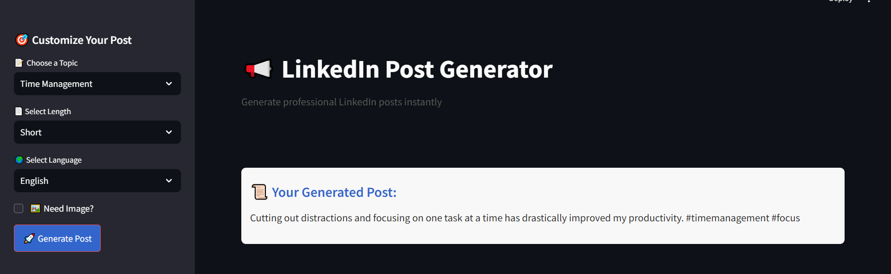

# Linkedin Post Generator with image
This tool will analyze posts of a LinkedIn influencer and help them create the new posts and even images based on the writing style in their old posts  

For example, consider Alex, a LinkedIn influencer who frequently shares insights on technology and leadership. By using this tool, Alex can input their previous LinkedIn posts, and the tool will analyze and extract key topics, language patterns, and post lengths. Alex can then choose specific parameters such as topic, length, and language for their new post. By clicking the Generate button, the tool will create a new post that aligns with Alex's unique writing style, ensuring consistency and engagement with their audience. If Alex wants, this tool can generate a photo according to the post.

**RUN on WEB :** To run this tool and see working you can just [click here](https://linedkinpostgenerate.streamlit.app/) without the need of any technical acspect of installing this repository

## Working Example
Generation of post by just selection of topic, length of content and language, post is generated


If Image is also needed just check the 'need image' option, and that's it image will be generated 


## Technical Architecture

1. Collect LinkedIn posts and identify the main topics, language, and length of each post.
2. Use the identified topic, language, and length to create a new post. The tool will use some of the previous posts related to the chosen topic, language, and length to help the language model understand the writing style.
3. Using diffusion model and Hugguging Face inference generated image according to current post

**Note:** The training dataset is sourced from codebasics.co . However, if you prefer, you can manually scrape data or use API methods to web scrape the data using Beautiful Soup.

## Set-up

1. **Obtain API Keys:**
    - Get an API key from [Groq](https://console.groq.com/keys).
    - Get an API key from [Hugging Face](https://huggingface.co/settings/tokens).
    - Update the `.toml` file in `.streamlit` directory in yopur project with the obtained keys:
      ```
      GROQ_API_KEY=your_groq_api_key
      HF_TOKEN=your_huggingface_token
      ```

2. **Install Dependencies:**
    - Run the following command to install the required dependencies:
      ```bash
      pip install -r requirements.txt
      ```

3. **Run the Streamlit App:**
    - Start the application by running:
      ```bash
      streamlit run main.py
      ```

## Contributing

We welcome contributions to improve this project! Here are some ways you can contribute:

1. **Report Bugs:** If you find a bug, please report it by opening an issue on GitHub.
2. **Suggest Features:** If you have an idea for a new feature, please share it by opening an issue.
3. **Submit Pull Requests:** If you want to contribute code, fork the repository and submit a pull request with your changes.

## License

This project is licensed under the MIT License. See the [LICENSE](LICENSE) file for more details.

## Contact

If you have any questions or need further assistance, feel free to contact us at [itamazes@example.com](mailto:itamazes@example.com).

## Acknowledgements

I would like to thank the following resources and libraries that made this project possible:

- [Streamlit](https://streamlit.io/)
- [Hugging Face](https://huggingface.co/)
- [Groq](https://groq.com/)

